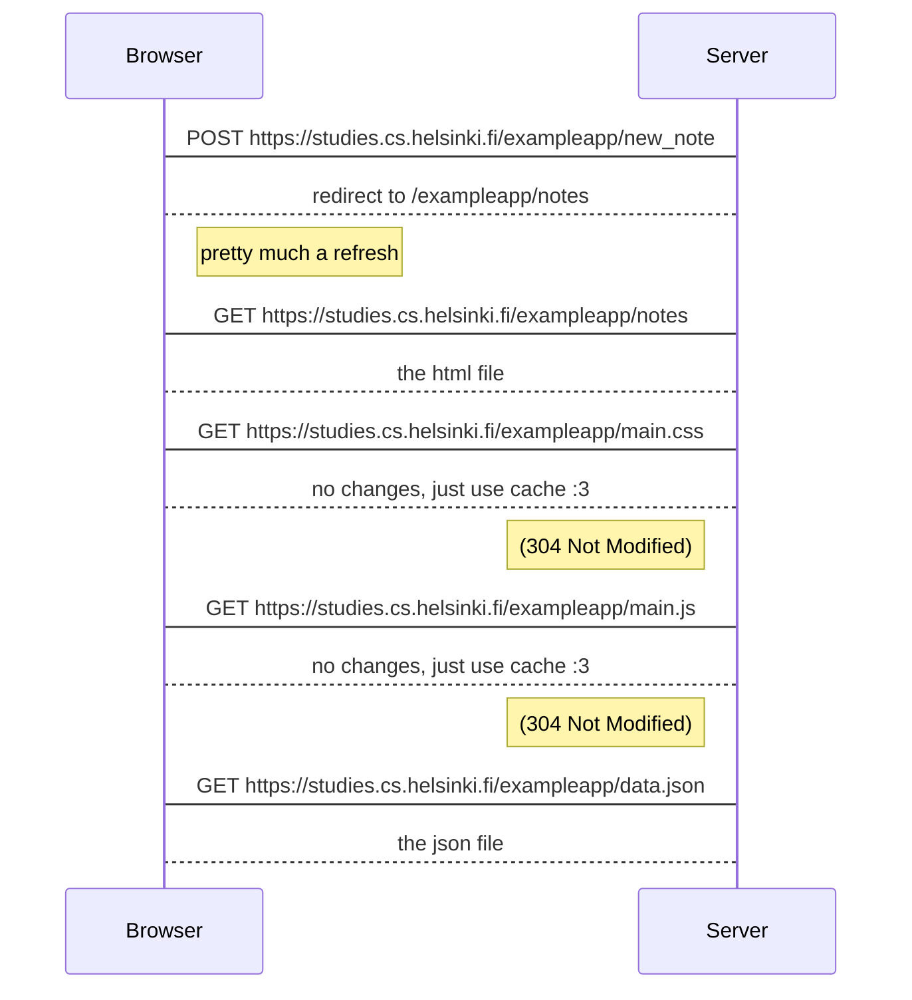

```mermaid
sequenceDiagram
    Browser->Server: POST https://studies.cs.helsinki.fi/exampleapp/new_note
    Server-->Browser: redirect to /exampleapp/notes
    note right of Browser: pretty much a refresh
    Browser->Server: GET https://studies.cs.helsinki.fi/exampleapp/notes
    Server-->Browser: the html file
    Browser->Server: GET https://studies.cs.helsinki.fi/exampleapp/main.css
    Server-->Browser: no changes, just use cache :3
    note left of Server: (304 Not Modified)
    Browser->Server: GET https://studies.cs.helsinki.fi/exampleapp/main.js
    Server-->Browser: no changes, just use cache :3
    note left of Server: (304 Not Modified)
    Browser->Server: GET https://studies.cs.helsinki.fi/exampleapp/data.json
    Server-->Browser: the json file
```