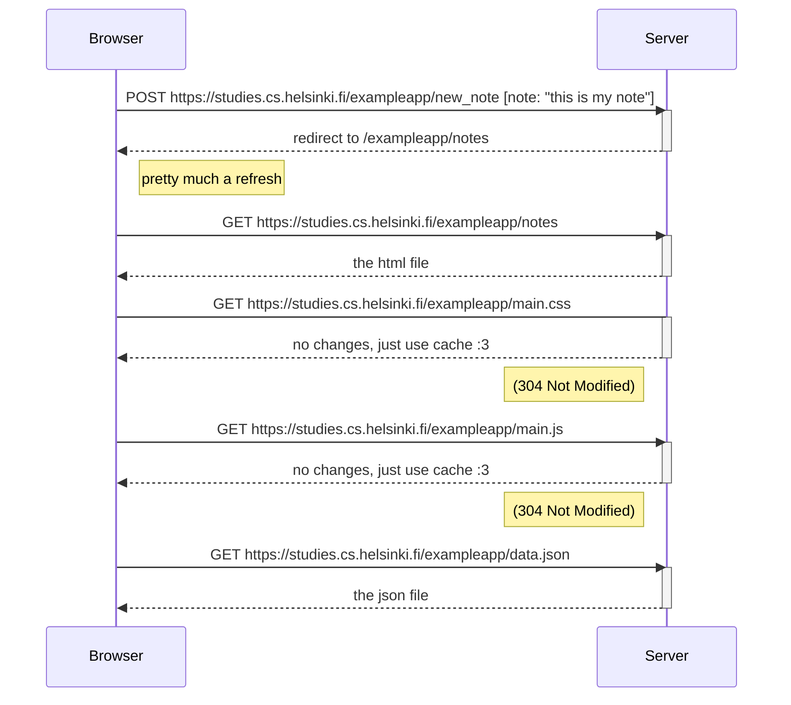

```mermaid
sequenceDiagram
    participant Browser
    participant Server
    Browser->>Server: POST https://studies.cs.helsinki.fi/exampleapp/new_note [note: "this is my note"]
    activate Server
    Server-->>Browser: redirect to /exampleapp/notes
    deactivate Server
    
    note right of Browser: pretty much a refresh
    Browser->>Server: GET https://studies.cs.helsinki.fi/exampleapp/notes
    activate Server
    Server-->>Browser: the html file
    deactivate Server
    
    Browser->Server: GET https://studies.cs.helsinki.fi/exampleapp/main.css
    activate Server
    Server-->>Browser: no changes, just use cache :3
    deactivate Server
    
    note left of Server: (304 Not Modified)
    Browser->>Server: GET https://studies.cs.helsinki.fi/exampleapp/main.js
    activate Server
    Server-->>Browser: no changes, just use cache :3
    deactivate Server
    
    note left of Server: (304 Not Modified)
    Browser->>Server: GET https://studies.cs.helsinki.fi/exampleapp/data.json
    activate Server
    Server-->>Browser: the json file
    deactivate Server
    
```